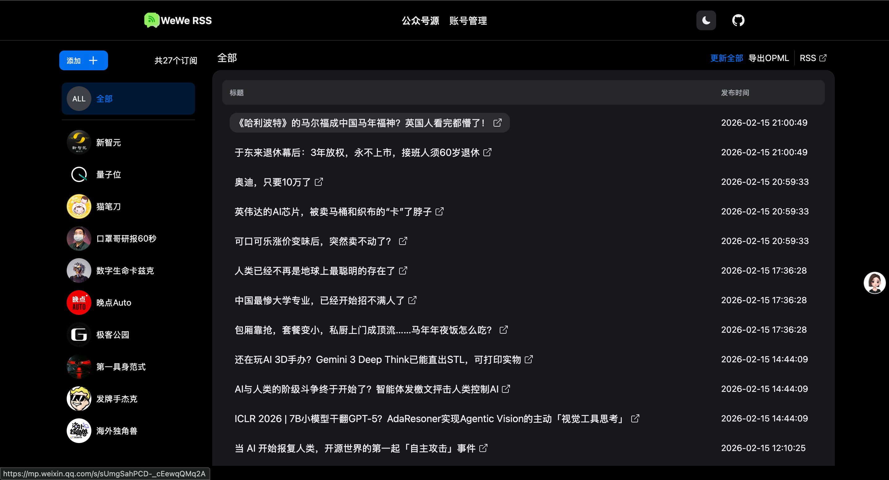
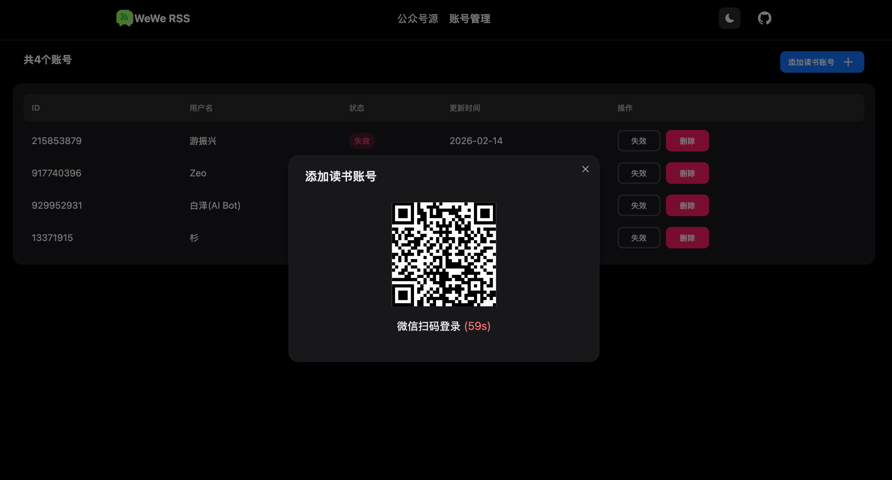
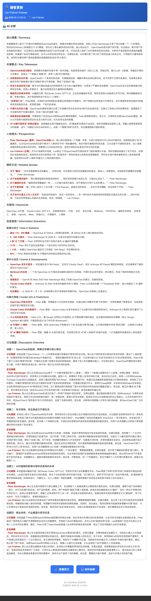

# info_hub

> ⚠️ **重要声明**：本项目尚未在独立环境重新验证过，部署过程中可能会遇到各种问题，不保证一次性配置就能跑通。请尽量使用Clade Code等Coding Agent进行辅助部署。

本项目是一套信息聚合与自动化推送系统，主要功能包括公众号聚合、播客更新监控，社区热点追踪以及投资数据分析。

## 业务流程图

```
┌─────────────────────────────────────────────────────────────────────────────────┐
│                                   info_hub 业务流程                              │
└─────────────────────────────────────────────────────────────────────────────────┘

┌─────────────────────────────────────────────────────────────────────────────────┐
│  1. 公众号聚合                                                                  │
│  ┌──────────────┐    ┌──────────────┐    ┌──────────────┐    ┌──────────────┐│
│  │  手动触发     │ -> │  WeWe RSS    │ -> │  3天内文章   │ -> │  AI 分析     ││
│  │  公众号扫描   │    │  获取文章列表 │    │  过滤        │    │  摘要生成    ││
│  └──────────────┘    └──────────────┘    └──────────────┘    └──────────────┘│
│                                                                            │    │
│  ┌──────────────┐                                                        │    │
│  │  邮件推送    │ <- ──────────────────────────────────────────────────────┘    │
│  └──────────────┘                                                             │
└─────────────────────────────────────────────────────────────────────────────────┘

┌─────────────────────────────────────────────────────────────────────────────────┐
│  2. 播客更新                                                                   │
│  ┌──────────────┐    ┌──────────────┐    ┌──────────────┐    ┌──────────────┐│
│  │  定时扫描    │ -> │  下载最新     │ -> │  AssemblyAI  │ -> │  SiliconFlow ││
│  │  RSS 订阅    │    │  音频文件     │    │  语音转写    │    │  AI 分析     ││
│  └──────────────┘    └──────────────┘    └──────────────┘    └──────────────┘│
│                                                                            │    │
│  ┌──────────────┐                                                        │    │
│  │  邮件推送    │ <- ──────────────────────────────────────────────────────┘    │
│  └──────────────┘                                                             │
└─────────────────────────────────────────────────────────────────────────────────┘

┌─────────────────────────────────────────────────────────────────────────────────┐
│  3. 社区热点                                                                   │
│  ┌──────────────┐    ┌──────────────┐    ┌──────────────┐    ┌──────────────┐│
│  │  定时扫描     │ -> │  内容聚合     │ -> │  AI 筛选     │ -> │  邮件推送    ││
│  │  Hacker News等   │  热门话题    │    │  价值内容    │    │             ││
│  └──────────────┘    └──────────────┘    └──────────────┘    └──────────────┘│
└─────────────────────────────────────────────────────────────────────────────────┘
```

## 功能介绍

### 1. 公众号聚合
- 通过 WeWe RSS 服务获取公众号更新
- **手动触发扫描**：由于微信对频繁扫描有限流机制，采用手动触发方式更新公众号文章
- **3天内文章处理**：扫描到文章列表后，系统自动过滤出 3 天内发布的文章
- AI 自动分析过滤后的文章并生成摘要
- 邮件推送日报

**当前订阅的公众号**：
- 新智元、量子位、机器之心
- 第一具身范式、具身智能之心
- 虎嗅APP、36氪、36氪Pro
- 猫笔刀、口罩哥研报60秒
- 数字生命卡兹克、发牌手杰克
- HK EX New-listing、雪球
- 极客公园、科技暴论
- 深蓝AI、深蓝具身智能
- 硬科技新势力、01Founder
- 海外独角兽、晚点Auto
- 重远投资观、泽平宏观
- 刘小排r、红色星际、证券时报

### 2. 播客更新
- **定时逻辑**：每 2 小时轮询 RSS，发现新节目即时处理
- **去重机制**：数据库记录已处理的 episode，新播客阈值 2 天
- **长音频处理**：超过 2 小时自动切段，段间重叠 2 分钟，AI 处理拼接去重
- **语音转写**：支持 AssemblyAI（推荐，含说话人分离）、SiliconFlow SenseVoice、本地 WhisperX
- **AI 分析**：DeepSeek R1 模型生成摘要、要点、适合人群
- 定时推送邮件通知

**处理流程**：RSS 轮询 → 下载音频 → ASR 转写 → AI 分析 → 邮件推送

**当前订阅的播客**：
- 晚点聊 LateTalk
- 投资实战派
- 硬地骇客
- The Prompt
- The Alphaist
- On Board
- 硅谷101
- 张小珺Jùn｜商业访谈录
- 罗永浩的十字路口
- Latent Space (AI Engineer Podcast)
- Lex Fridman Podcast
- The Joe Rogan Experience
- Acquired
- Business Breakdowns
- Huberman Lab
- Modern Wisdom
- The a16z Show
- Anything Goes with Emma Chamberlain

### 3. 社区热点
- **数据源**：HackerNews + Reddit + Github Trend + ProductHub
- **关注话题**：AI、LLM、AGI、机器人、AI硬件、创业、投资等
- **Reddit 社区**：MachineLearning、artificial、robotics、startups、venturecapital
- **筛选规则**：HackerNews 24小时内得分>10，Reddit 24小时内得分>5
- AI 自动化内容筛选与分析
- 每天下午 6 点定时推送邮件

### 4. 投资板块
- ⚠️ **注意**：该功能目前尚不完善，处于测试阶段
- 尝试进行投资数据分析
- 建议仅用于学习研究

---

## 部署方式

⚠️ **强烈建议**：使用 Claude Code 等 AI 工具读取 `CLAUDE.md`、`agents/` 和 `DESENSITIZATION_GUIDE.md` 来辅助部署。由于项目配置复杂，AI 工具能帮助你理解配置方法和常见问题解决方案。

---

## 配置步骤

### 环境要求
- Python 3.10+
- Docker (可选，用于容器化部署)
- 代理（访问海外网站和 AI API）

### 定时任务

| 模块 | 执行方式 | 执行时间/间隔 | 说明 |
|------|----------|---------------|------|
| 播客 | 间隔执行 | 每 2 小时 | 轮询 RSS，发现新节目即时处理 |
| 投资 | 固定时间 | 11:30, 23:30 | 午间和收盘后分析 |
| 社区 | 固定时间 | 05:00 | 查看昨日全球热点 |
| 公众号 | 固定时间 | 23:00 | 手动触发（微信限流） |
| 日志报告 | 固定时间 | 23:30 | 每日汇总 |

### 1. 克隆项目
```bash
git clone <repository-url>
cd info_hub
```

### 2. 配置 API Key 和授权码

详细配置说明请参考 [DESENSITIZATION_GUIDE.md](./DESENSITIZATION_GUIDE.md)。

主要需要配置：
- SiliconFlow API Key（AI 内容分析，使用 DeepSeek-V3/DeepSeek-R1 模型）
- 163 邮箱授权码（邮件推送）
- WeWe RSS 授权码（公众号抓取，需在 WeWe RSS 服务中自行设置）
- AssemblyAI API Key（语音转文字 + 说话人分离）

获取方式：
| 服务 | 获取地址 |
|------|----------|
| SiliconFlow | https://siliconflow.cn |
| 163邮箱 | 邮箱设置 → POP3/SMTP/IMAP → 开启并获取授权码 |
| WeWe RSS | 在 WeWe RSS 服务中自行设置授权码 |
| AssemblyAI | https://www.assemblyai.com |

### 3. 代理配置

**为什么需要代理**：
- 访问海外网站（Reddit、Twitter、YouTube 等）需要代理
- 部分 AI API 在国内需要代理访问

**哪些地方使用了代理**：
- 热榜爬虫：`crawler.use_proxy`, `crawler.default_proxy`
- RSS 订阅：`rss.use_proxy`, `rss.proxy_url`
- 播客下载：`podcast.proxy.enabled`, `podcast.proxy.url`
- AI API 调用：使用智能代理，直连失败时自动切换代理

**如何配置（Clash Verge）**：

编辑 `config/config.yaml`：

```yaml
# 爬虫代理
crawler:
  use_proxy: true
  default_proxy: "http://127.0.0.1:10801"  # 本地直接运行

# RSS 代理
rss:
  use_proxy: true
  proxy_url: "http://127.0.0.1:10801"

# 播客代理
podcast:
  proxy:
    enabled: true
    url: "http://127.0.0.1:10801"
```

**Docker 部署时**：
- 容器访问宿主机代理使用：`http://host.docker.internal:7897`
- 需要确保代理服务允许局域网访问

### 4. 配置文件

编辑 `config/config.yaml` 和 `config/system.yaml`，将配置项替换为你的实际值。

---

## 部署方式

### 方式一：Docker 部署（推荐）
```bash
docker-compose up -d
```

### 方式二：本地直接运行
```bash
pip install -r requirements.txt
python -m trend
```

---

## 示例截图

### WeWe RSS 管理界面


### WeWe RSS 登录界面


### 公众号日报示例


### 播客更新示例


### 社区热点示例


---

## 公众号管理

通过 WeWe RSS 服务管理公众号订阅：
1. 访问 WeWe RSS 服务
2. 扫码登录
3. 添加公众号进行订阅

---

## 注意事项

1. **不要提 PR**：本项目未在独立环境重新验证，PR 不会被处理
2. **投资板块**：该功能目前不完善，仅供学习研究
3. **数据安全**：请妥善保管你的 API Key 和授权码，不要提交到公共仓库

---

## 文档说明

本项目包含以下文档供部署参考：

| 文档 | 说明 |
|------|------|
| `CLAUDE.md` | 完整的开发记录与技术细节 |
| `agents/` | 各种开发任务记录与问题解决过程 |
| `DESENSITIZATION_GUIDE.md` | 脱敏记录与配置指南 |

---

## 致谢

本项目参考了以下开源项目：

- **[TrendRadar](https://github.com)** - 本项目的前身
- **[WeweRSS](https://github.com/cooderl/wewe-rss)** - 微信公众号 RSS 订阅服务

其他依赖：
- [SiliconFlow](https://siliconflow.cn) - AI API 服务
- [AssemblyAI](https://www.assemblyai.com) - 语音转文字 + 说话人分离服务
- [DeepSeek](https://deepseek.com) - 大语言模型

---

## 许可证

MIT License
