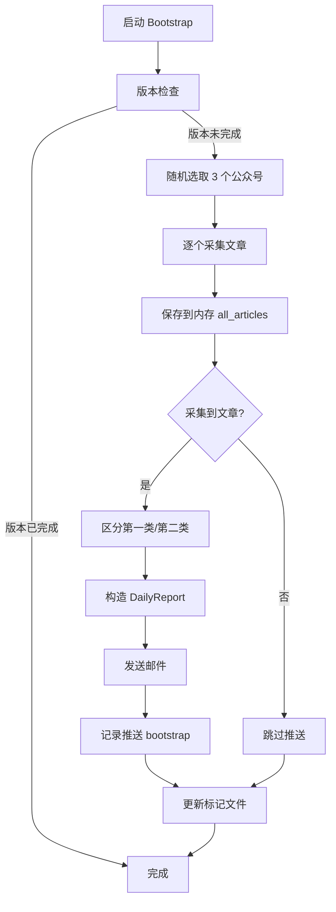

# Bootstrap 机制增强实现文档

## 📋 实现概述

**版本**: v5.24.0
**日期**: 2026-02-05
**作者**: Claude Code

### 核心改进
Bootstrap 机制现在可以在**不保存数据库**的情况下**触发邮件推送**，让用户能够在首次启动时立即验证配置是否正确。

---

## 🎯 设计目标

### 用户需求
- ✅ 不污染数据库（保留 23:00 定时任务的完整性）
- ✅ 立即发送验证邮件（确认功能正常）
- ✅ 快速执行（跳过 AI 分析）

### 技术挑战
**核心问题**：`analyzer.analyze_daily()` 依赖数据库查询

```python
# src/analyzer.py:109-110
critical_articles = self.storage.get_today_articles(FeedType.CRITICAL)
normal_articles = self.storage.get_today_articles(FeedType.NORMAL)
```

**解决方案**：跳过 `analyze_daily()`，直接构造 `DailyReport` 对象

---

## 🔧 实现细节

### 修改文件
**文件**: `wechat/main.py`
**函数**: `cmd_bootstrap()`
**位置**: 第 221-345 行

### 核心流程



### 关键代码片段

#### 1. 内存采集（不保存数据库）
```python
# ✅ 逐个采集（仅内存中，不保存数据库）
all_articles = []
for feed in selected_feeds:
    articles = collector._collect_feed(feed)
    all_articles.extend(articles)  # 仅保存到内存
```

#### 2. 直接构造报告（跳过分析）
```python
# ✅ 构造简化的 DailyReport（直接使用内存中的文章）
from src.models import DailyReport, FeedType

# 区分第一类和第二类文章
critical_articles = [a for a in all_articles if a.feed_type == FeedType.CRITICAL]
normal_articles = [a for a in all_articles if a.feed_type == FeedType.NORMAL]

# 构造报告
report = DailyReport(
    date=datetime.now(),
    critical_articles=critical_articles,
    topics=[],  # 跳过话题聚合
    total_articles=len(all_articles),
    critical_count=len(critical_articles),
    normal_count=len(normal_articles)
)
```

#### 3. 独立推送类型（不冲突）
```python
# 发送邮件
success = notifier.send_daily_report(report)

if success:
    # 记录推送（类型为 bootstrap，不与 daily 冲突）
    storage.record_push("bootstrap", report.total_articles)
```

---

## ✅ 方案特点

### 优点
1. ✅ **不保存数据库**：避免污染当天数据
2. ✅ **立即触发邮件**：用户可以验证功能
3. ✅ **执行快速**：跳过 AI 分析，只采集和发送
4. ✅ **不冲突**：推送类型为 "bootstrap"，不影响 daily
5. ✅ **数据清洁**：23:00 的定时任务会采集完整数据

### 缺点
1. ⚠️ 邮件内容简化：没有话题聚合（`topics=[]`）
2. ⚠️ 文章数量有限：只有 3 个公众号的文章

### 预期效果
**邮件内容**：
- 主题：包含日期
- 第一类文章：完整显示（原文 + 标题）
- 第二类文章：显示摘要
- 总数：约 10-30 篇文章（取决于公众号）

**执行时间**：约 15-30 秒（3 个公众号 × 5 秒/个）

---

## 🧪 验证步骤

### 自动验证脚本
```bash
# 执行自动验证脚本
cd /home/zxy/Documents/code/TrendRadar
bash agents/verify_bootstrap.sh
```

### 手动验证步骤

#### Step 1: 删除标记文件
```bash
docker exec wechat-service rm /app/data/.wechat_bootstrap_done
```

#### Step 2: 重启容器
```bash
cd /home/zxy/Documents/code/TrendRadar/wechat
docker compose restart wechat-service
```

#### Step 3: 查看日志
```bash
docker logs wechat-service 2>&1 | grep -A 30 "Bootstrap"
```

#### 预期输出
```
[Wechat][Bootstrap] ═══ 启动引导检查 ═══
[Wechat][Bootstrap] APP_VERSION=5.24.0
[Wechat][Bootstrap] 标记文件版本=(不存在)
[Wechat][Bootstrap] 全部公众号数: 27
[Wechat][Bootstrap] 随机选取3个: xxx, yyy, zzz
[Wechat][Bootstrap] 采集 xxx: N篇 | 耗时=X.Xs
[Wechat][Bootstrap] 采集 yyy: N篇 | 耗时=X.Xs
[Wechat][Bootstrap] 采集 zzz: N篇 | 耗时=X.Xs
[Wechat][Bootstrap] 共采集 N 篇，触发推送（不保存数据库）...
[Wechat][Bootstrap] 第一类: N 篇，第二类: N 篇
[Wechat][Bootstrap] 发送邮件 (N 篇)...
[Wechat][Bootstrap] 推送成功 ✅
[Wechat][Bootstrap] 标记更新 → 5.24.0 ✅
```

#### Step 4: 检查邮件
- 检查收件箱
- 验证邮件内容是否包含采集的文章
- 确认推送类型为 "bootstrap"

#### Step 5: 验证数据库未被污染
```bash
docker exec wechat-service python -c "
import sqlite3
conn = sqlite3.connect('/app/data/wechat.db')
cursor = conn.cursor()
cursor.execute('SELECT COUNT(*) FROM articles')
count = cursor.fetchone()[0]
print(f'数据库文章数: {count}')
"
```

**预期**：文章数量应该为 0（或只有之前的数据）

---

## 📊 与定时任务的关系

### Bootstrap 推送
- **触发时间**：容器启动时立即执行
- **文章来源**：随机 3 个公众号
- **数据保存**：不保存数据库
- **推送类型**：`bootstrap`
- **邮件内容**：简化版（无话题聚合）

### Daily 推送
- **触发时间**：每天 23:00
- **文章来源**：所有公众号
- **数据保存**：保存到数据库
- **推送类型**：`daily`
- **邮件内容**：完整版（含话题聚合）

### 互不干扰
- ✅ `has_pushed_today()` 只检查 `daily` 类型
- ✅ `bootstrap` 推送不会影响 `daily` 推送
- ✅ 23:00 的定时任务会正常执行

---

## 🔍 技术要点

### 1. 为什么不调用 `storage.save_article()`？
- **原因**：会污染数据库，导致 23:00 的定时任务采集到重复数据
- **解决**：仅保存在内存 `all_articles` 列表中

### 2. 为什么跳过 `analyzer.analyze_daily()`？
- **原因**：它依赖数据库查询 `storage.get_today_articles()`
- **解决**：直接构造 `DailyReport` 对象

### 3. 为什么使用 `storage.record_push("bootstrap", ...)`？
- **原因**：避免与 `daily` 推送冲突
- **好处**：`has_pushed_today()` 只检查 `daily` 类型

### 4. 为什么 `topics=[]`？
- **原因**：话题聚合需要 AI 分析，耗时且需要数据库
- **解决**：简化邮件内容，只显示原始文章列表

---

## 🎯 总结

### 设计原则
1. ✅ **不污染数据库**：Bootstrap 采集的文章不保存
2. ✅ **验证功能**：立即发送邮件，确认功能正常
3. ✅ **快速执行**：跳过 AI 分析，缩短执行时间
4. ✅ **互不干扰**：不影响 23:00 的定时任务

### 实现要点
1. 跳过 `analyzer.analyze_daily()`（它依赖数据库）
2. 直接构造 `DailyReport` 对象
3. 使用内存中的文章发送邮件
4. 推送记录类型为 "bootstrap"

### 预期效果
- ✅ 容器启动后立即收到验证邮件
- ✅ 数据库保持清洁（只有 23:00 的数据）
- ✅ 用户可以立即验证配置是否正确

---

## 📝 相关文件

### 修改的文件
- `wechat/main.py` - Bootstrap 函数实现

### 新增的文件
- `agents/verify_bootstrap.sh` - 自动验证脚本
- `agents/bootstrap_implementation.md` - 本文档

### 相关代码
- `src/models.py` - DailyReport、Article、FeedType 定义
- `src/analyzer.py` - analyze_daily() 依赖数据库
- `src/storage.py` - record_push() 支持不同类型
- `src/notifier.py` - send_daily_report() 发送邮件

---

## 🚀 未来改进方向

### 可能的优化
1. **智能采样**：根据公众号活跃度选择，而非随机
2. **话题聚合**：在内存中实现轻量级话题聚合
3. **错误恢复**：推送失败时支持重试
4. **配置化**：允许用户自定义采样数量

### 已知限制
1. 邮件内容简化（无话题聚合）
2. 采样数量固定（3个公众号）
3. 仅在容器启动时执行（非手动触发）

---

**文档版本**: 1.0
**最后更新**: 2026-02-05
